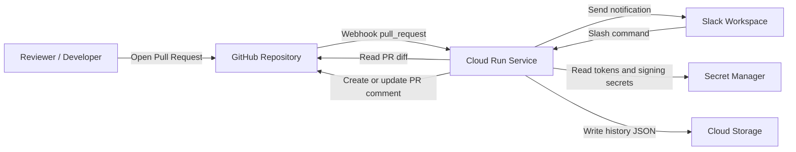
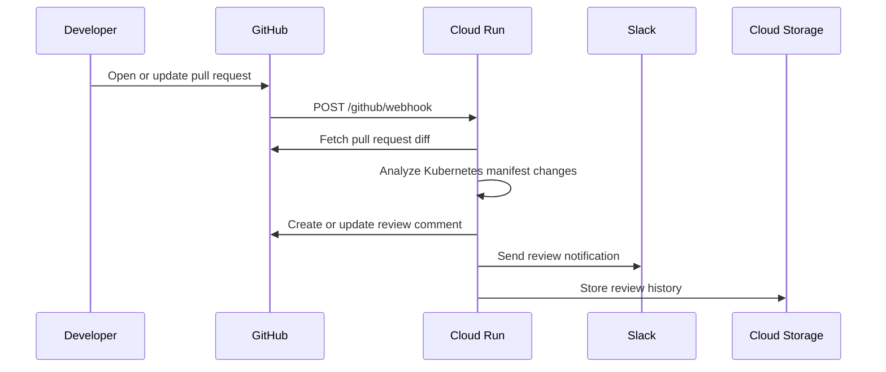
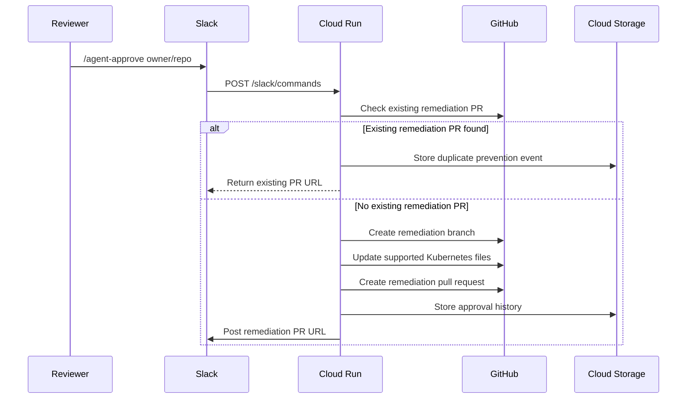

# Architecture

## System Context

## Review Flow

## Slack Approval Flow

## Data Stores

| Store | Purpose |
|---|---|
| GitHub Pull Request comments | Human-readable review report |
| GitHub Pull Requests | Remediation changes |
| Cloud Storage | Review and approval history JSON |
| Secret Manager | GitHub and Slack credentials |
