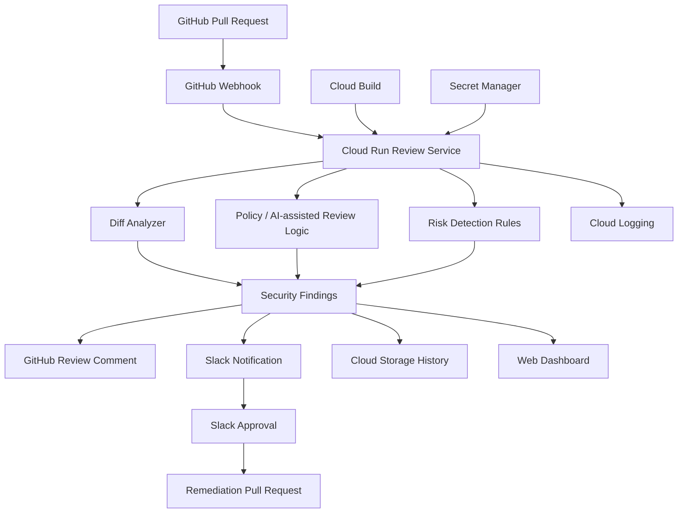
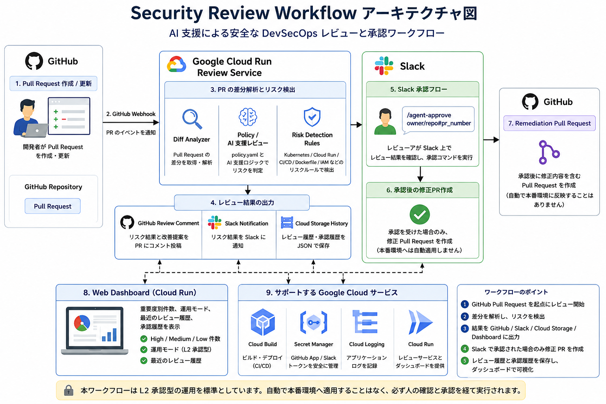

# Architecture Diagram Source

この内容をもとに、ProtoPedia用のアーキテクチャ図を作成する。

## Mermaid

## 図に入れる説明

- GitHub Pull Request を起点にレビューを開始
- Cloud Run 上の Review Service が差分を解析
- policy.yaml と AI 支援ロジックでリスクを判定
- GitHub review comment と Slack に通知
- Slack 承認後のみ修正 Pull Request を作成
- Cloud Storage にレビュー履歴と承認履歴を保存
- Web Dashboard で重要度別件数と履歴を可視化
- Cloud Build でデプロイ
- Secret Manager で GitHub / Slack 関連の秘密情報を管理

## 採用するシステム構成図

この図を ProtoPedia のシステム構成図として使用する。
